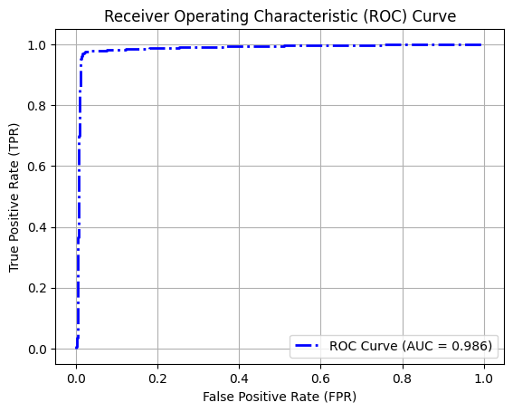
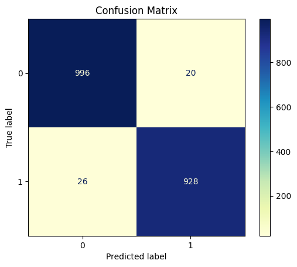

# NEISS Pedestrian Classification

This project classifies pedestrian-related incidents within the **NEISS (National Electronic Injury Surveillance System)** dataset by fine-tuning a transformer-based language model on free-text clinical narratives.

The primary focus is on the `Narrative_1` field — a short, free-text description of each emergency department visit. The goal is to identify whether a narrative describes a **pedestrian being struck by a motor vehicle**.

---

## Final Results

The final model, a **fully fine-tuned BERT (bert-base-uncased)** model, demonstrated **excellent performance**:

- **Accuracy**: 97.7% (95% CI: 96.9–98.3%)
- **Sensitivity**: 97.3% (95% CI: 96.5–97.9%)
- **Specificity**: 98.0% (95% CI: 97.3–98.5%)
- **AUC**: 0.986 (95% CI: 0.981–0.991)

> Model was trained and validated on a separate labeled set of ~1,000 samples (n = 939).
>
> Evaluation was conducted on ~2,000 manually labeled test samples (n = 1,970).  

### ROC Curve  
<p align="center">
  
</p>
<p align="center"><i>ROC Curve demonstrating high discriminative performance (AUC = 0.986)</i></p>

### Confusion Matrix  
<p align="center">
  
</p>
<p align="center"><i>Confusion Matrix on ~2,000 manually labeled test samples</i></p>


---

## Project Overview

- **`neiss_colab.ipynb`**  
  Main training notebook (Google Colab). Fine-tunes a full BERT model on combined narrative and structured features (e.g., Body Part, Diagnosis, Disposition, Product 1) using GPU acceleration.

- **`data`**  
  Data used for this project. Train/validation set, holdout set, overall data, data that model was evaluated on to get the final cohort

- **`old_models/`**  
  Early experimentation using DistilBERT and PEFT (LoRA). Ultimately, full fine-tuning provided better results and was chosen for the final model.

---

## Repository Structure

```python
NEISS/
│
├── data/                           # Contains NEISS data (2014–2023) downloaded from the official site
│   ├── labeled_data/               # Hand-labeled samples used for training and evaluation
│   
│
├── old models/                     # Earlier model experiments using DistilBERT and LoRA
│   └── results/                    # Checkpoints and results from old model training runs             
│
│ 
├── images/                         # Images used in README file
│
│ 
├── neiss_colab.ipynb               # Google Colab notebook: fine-tunes BERT (no LoRA) using GPU
└── README.md                       # Project overview and instructions
```

## Model Deployment

The best-performing model was fully fine-tuned and uploaded to the Hugging Face Model Hub under the repository 
<a href="https://huggingface.co/DevJGraham/neiss_clf_bert_uncased_v3/" target="_blank">DevJGraham/neiss_clf_bert_uncased_v3</a>

You can easily load the model and tokenizer using the Hugging Face `transformers` library:

```python
from transformers import AutoModelForSequenceClassification, AutoTokenizer

model = AutoModelForSequenceClassification.from_pretrained("DevJGraham/neiss_clf_bert_uncased_v3")
tokenizer = AutoTokenizer.from_pretrained("DevJGraham/neiss_clf_bert_uncased_v3")
```


